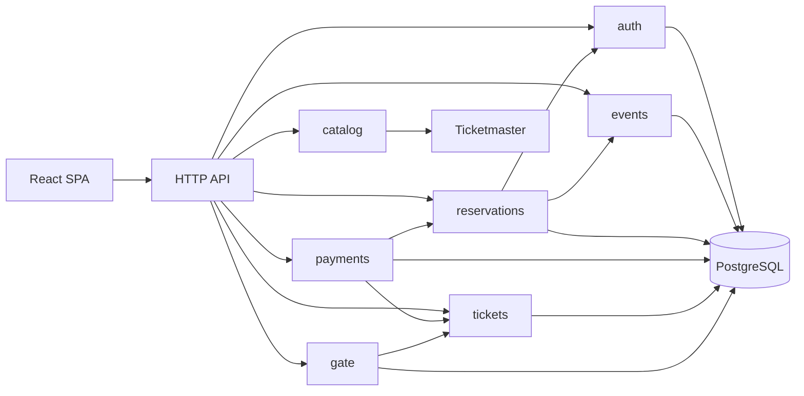
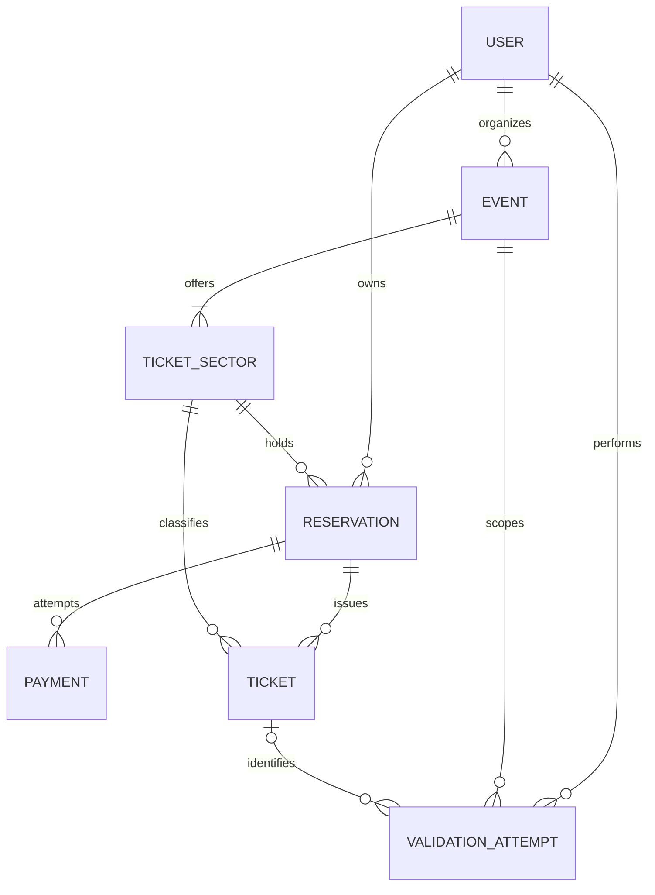
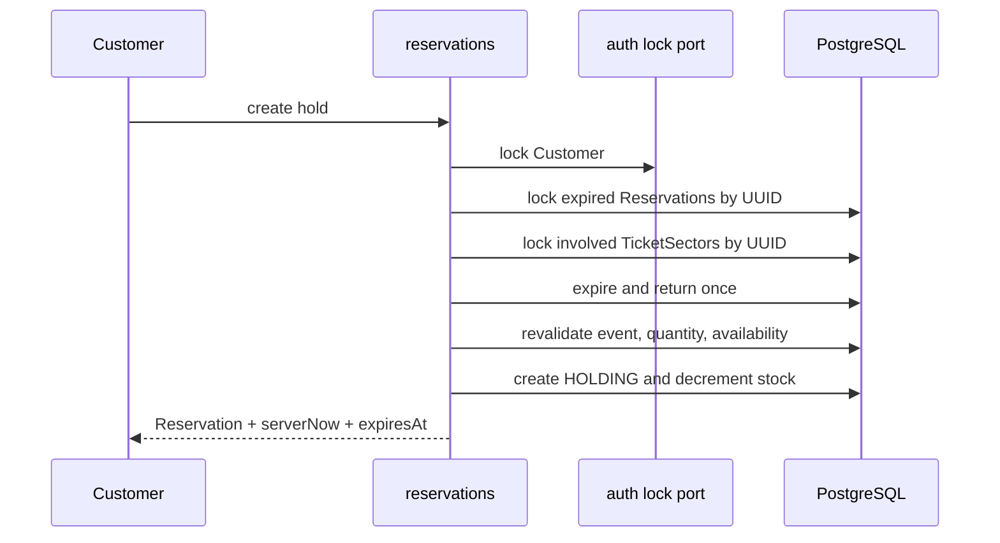

# Architecture Spine — EliteDevTicket

## Design Paradigm

Monólito modular pragmático, organizado por capacidade, com Ports and Adapters leves somente em fronteiras reais, integrações externas e seams de teste.



Dependências entre capacidades atravessam serviços de aplicação ou ports explícitos; nenhum módulo acessa entidade JPA ou repository interno de outro módulo.

## Invariants & Rules

### AD-1 — Fronteiras do monólito modular [ADOPTED]

- **Binds:** todos os módulos backend
- **Prevents:** camadas globais acopladas e abstrações cerimoniais
- **Rule:** Organizar por `auth`, `catalog`, `events`, `reservations`, `payments`, `tickets` e `gate`; dentro de cada módulo, HTTP adapta DTOs, application coordena casos de uso/transações, domain mantém regras e adapters implementam persistência/integração. Criar ports apenas em fronteiras entre módulos, integrações ou seams de teste.

### AD-2 — Ownership de Event, TicketSector e disponibilidade [ADOPTED]

- **Binds:** events, reservations
- **Prevents:** dois módulos ajustando estoque livremente ou um módulo inventory não aprovado
- **Rule:** `events` é dono de `Event` e `TicketSector` e configura nome, descrição, preço e capacidade; `reservations` é dono de `Reservation` e exclusivamente consome/devolve disponibilidade por hold/expiração. Em mudança de capacidade, `committed = capacity - availableQuantity`, exigir `newCapacity >= committed` e definir `newAvailableQuantity = newCapacity - committed`; nunca ajustar estoque arbitrariamente.

### AD-3 — Serialização de estoque e capacidade [ADOPTED]

- **Binds:** events, reservations, PostgreSQL
- **Prevents:** overselling, capacidade inválida e updates perdidos
- **Rule:** Toda mutação de `TicketSector.capacity` ou `availableQuantity` usa `PESSIMISTIC_WRITE`; o banco também impõe `capacity > 0`, `0 <= availableQuantity <= capacity` e `price >= 0`.

### AD-4 — Um hold vigente por Customer e Event [ADOPTED]

- **Binds:** auth, reservations, FR-27
- **Prevents:** corrida entre criações simultâneas de hold do mesmo Customer
- **Rule:** Durante criação de hold, `reservations` bloqueia o Customer por port explícito fornecido por `auth`, sem acessar entidade/repository de auth, e então localiza/reconcilia a Reservation do Customer/Event.

### AD-5 — Ordem canônica de locks [ADOPTED]

- **Binds:** todas as transações concorrentes
- **Prevents:** deadlocks por aquisição incompatível
- **Rule:** Adquirir locks somente na ordem `Customer → Reservation → TicketSector`; quando houver múltiplas Reservations ou TicketSectors, ordenar cada conjunto por UUID crescente. Nunca adquirir TicketSector antes de Reservation ou Customer quando estes também forem necessários.

### AD-6 — Expiração sem falsa escassez [ADOPTED]

- **Binds:** reservations, FR-25, FR-27, FR-31
- **Prevents:** hold vencido aceito ou estoque retido até o scheduler
- **Rule:** Na criação, fixar `expiresAt = serverNow` autoritativo `+ 10 minutos` exatos; o hold nunca pausa, reinicia ou estende. `serverNow >= expiresAt` torna o hold semanticamente expirado, mesmo com status persistido `HOLDING`. Sob lock do Customer e antes de novo hold, reconciliar o hold vencido do mesmo Customer/Event independentemente do setor anterior e também os holds vencidos necessários para evitar falsa escassez no setor solicitado. Bloquear todas as Reservations envolvidas por UUID crescente e depois todos os seus TicketSectors distintos por UUID crescente, expirar/devolver cada uma exatamente uma vez e só então revalidar estoque. Toda operação crítica reconcilia expiração; scheduler de cleanup roda por padrão a cada 30 s, em lotes pequenos e uma transação por Reservation.

### AD-7 — Idempotência da criação de Reservation [ADOPTED]

- **Binds:** reservations, FR-28
- **Prevents:** hold ou baixa de estoque duplicados por retry/double-click
- **Rule:** Persistir registro sem TTL, único por `(customerId, idempotencyKey)`, com hash do payload canônico, `reservationId` e timestamps. Mesmo hash reconstrói a Reservation existente; hash diferente retorna `IDEMPOTENCY_CONFLICT`.

### AD-8 — Transação de Payment e emissão [ADOPTED]

- **Binds:** payments, reservations, tickets, FR-33..FR-37
- **Prevents:** pagamento de hold vencido, confirmação parcial e Tickets duplicados
- **Rule:** Toda tentativa bloqueia e revalida uma Reservation `HOLDING` vigente. `DECLINED` persiste após essa validação e não altera a Reservation. `APPROVED`, mudança para `CONFIRMED` e emissão de exatamente `quantity` Tickets ocorrem na mesma transação; cada Ticket possui ordinal/issuance key com unicidade equivalente a `UNIQUE(reservation_id, ordinal)`.

### AD-9 — Reconciliação de tentativa de pagamento [ADOPTED]

- **Binds:** payments, checkout UX
- **Prevents:** cobrança repetida ou estado ambíguo após perda de resposta
- **Rule:** O frontend gera UUID `paymentAttemptId` antes de cada tentativa deliberada; o backend aplica AD-23, processa/persiste esse ID uma vez e permite consultá-lo. Retry/reconciliação usa o mesmo ID; nova tentativa após `DECLINED` usa novo ID; perda de resposta nunca dispara nova cobrança automaticamente. `PENDING` pode existir somente como estado técnico transitório.

### AD-10 — Autenticação de sessão e CSRF [ADOPTED]

- **Binds:** auth, SPA, FR-01..FR-04
- **Prevents:** exposição do JWT a JavaScript e mutações cross-site
- **Rule:** JWT em cookie `HttpOnly`, `SameSite=Lax`, `Secure` em demo/prod, assinado com HS256 e segredo externo criptograficamente aleatório de pelo menos 256 bits, distinto por ambiente, obrigatório fora de dev e nunca seedado/versionado. Validar assinatura e `exp`; TTL configurável com default de 8 h e expiração do cookie alinhada; sem refresh token. Senhas usam BCrypt com cost configurável por ambiente e default explícito no código/configuração de cold-start para novos hashes; testes verificam autenticação e parâmetros/cost do hash produzido, nunca um hash literal. CSRF permanece habilitado para a SPA e seu token legível pelo frontend é renovado após login e logout. Frontend/API operam sob a mesma origem lógica; CORS restringe origens configuradas.

### AD-11 — Intenção de compra antes do login [ADOPTED]

- **Binds:** Customer UX, auth, reservations, FR-24
- **Prevents:** estoque ou Reservation anônimos e perda do contexto de compra
- **Rule:** Antes do login, `sessionStorage` guarda somente `eventId`, `ticketSectorId`, `quantity`, `internalReturnPath` e `createdAt`, por 15 min; `internalReturnPath` aceita apenas rota interna permitida. Não guardar preço, token ou Reservation. Após login CUSTOMER, restaurar intenção e o backend revalidar evento, vendas, quantidade e estoque antes de criar/recuperar hold; limpar intenção após consumo, logout ou expiração.

### AD-12 — Contrato HTTP e outcomes funcionais [ADOPTED]

- **Binds:** API, SPA, todas as capacidades
- **Prevents:** clientes acoplados a mensagens e resultados de negócio tratados como falhas HTTP
- **Rule:** API sob `/api/v1`, com DTOs explícitos e OpenAPI versionado como autoridade dos requests, responses, autenticação, erros e outcomes do contrato MVP. PRD/Domain permanecem autoridade de comportamento e invariantes; DTOs Java e tipos TypeScript conformam ao OpenAPI por checks automatizados de drift, podendo o frontend derivar tipos, sem exigir geração de server/controller. Erros HTTP usam `{code, message, fieldErrors?, traceId, timestamp}`, com `code` estável e mensagem segura. `Payment DECLINED` e Gate `VALID | INVALID | ALREADY_USED | WRONG_EVENT` são outcomes no response model, não erros HTTP. Respostas nunca expõem stack, SQL, classes ou segredos.

### AD-13 — Segredos reexibíveis de Ticket [ADOPTED]

- **Binds:** tickets, gate, Meus Ingressos, compartilhamento
- **Prevents:** identificadores previsíveis, colisões e impossibilidade de reexibir QR/link/código
- **Rule:** Gerar `validationToken` e `shareToken` com alta entropia. Gerar `manualCode` criptograficamente seguro com 10 caracteres de alfabeto Base32 estilo Crockford sem caracteres ambíguos, exibir agrupado, normalizar caixa e separadores antes do lookup e impor `UNIQUE` no valor normalizado. Persistir os valores necessários à reexibição; nunca usar IDs previsíveis nem registrar segredos, códigos completos ou URLs compartilhadas completas. Tratar banco e backups como dados sensíveis.

### AD-14 — Validação atômica e replay da Gate [ADOPTED]

- **Binds:** gate, tickets, FR-43..FR-52
- **Prevents:** double-use e resposta ambígua após falha de rede
- **Rule:** O frontend gera UUID `validationAttemptId`; o backend aplica AD-23 e persiste `attemptId`, gateUser, selectedEvent, ticket quando identificável, método, resultado, `processedAt` e fingerprint seguro da entrada. Claim/finalização do ValidationAttempt e eventual transição atômica do Ticket para `USED`, com `usedAt` e `usedByGateUserId`, fazem commit na mesma transação. Resolver primeiro o attempt único: ID compatível reproduz o resultado original, inclusive `VALID`; payload incompatível retorna conflito. Verificar `WRONG_EVENT` antes do consumo e nunca mutar o Ticket nesse outcome. Nunca persistir QR/token/manualCode completos.

### AD-15 — Gate estritamente online [ADOPTED]

- **Binds:** gate, UX operacional
- **Prevents:** decisão local não autoritativa e falsa promessa de modo offline
- **Rule:** Sem comunicação com backend, a Gate não produz decisão de entrada nem enfileira validação; exibe indisponibilidade e permite nova tentativa/reconciliação online.

### AD-16 — Adapter de leitura de QR [ADOPTED]

- **Binds:** frontend Gate, browsers-alvo
- **Prevents:** UX acoplada a uma API de câmera incompatível ou dois pipelines obrigatórios
- **Rule:** Encapsular um caminho de câmera comprovado nos browsers-alvo em `QrDecoder`; implementação JS pode ser baseline/fallback e `BarcodeDetector` apenas progressive enhancement. Código manual é sempre disponível. Exigir contexto seguro, preferir câmera traseira, permitir seleção quando suportada, parar tracks ao sair da rota, restaurar com segurança após aba oculta e pausar decoding após leitura até resultado/“Validar próximo”, sem exigir recriar a sessão.

### AD-17 — Timer de hold autoritativo [ADOPTED]

- **Binds:** reservations API, checkout UX
- **Prevents:** decisão baseada no relógio civil do cliente ou timer divergente após suspensão
- **Rule:** Snapshots de Reservation incluem `serverNow`, `expiresAt` e `status`. A UI ancora `syncedServerNow` ao tempo monotônico (`performance.now`) e usa o elapsed apenas para apresentação. Reconciliar ao carregar/atualizar, voltar a `visible`, antes de pagar, ao chegar a zero e após erro/timeout; somente o backend decide vigência.

### AD-18 — Integração Ticketmaster [ADOPTED]

- **Binds:** catalog, events, FR-05..FR-08
- **Prevents:** segredo no cliente, latência multiplicada e identidade interna acoplada ao catálogo
- **Rule:** `CatalogProvider` é implementado por adapter backend Ticketmaster. Aplicar budget total configurável de aproximadamente 5 s, incluindo no máximo um retry para rede/timeout/5xx; não repetir 4xx genericamente e tratar 429 como rate limit/indisponibilidade sem espera longa. Sem cache/circuit breaker no MVP; mapear snapshot aprovado, ocultar segredo/payload bruto e permitir reutilização de `externalId`.

### AD-19 — Observabilidade mínima e segura [ADOPTED]

- **Binds:** backend, operação, NFR-15..NFR-18
- **Prevents:** diagnóstico sem correlação e vazamento de segredos
- **Rule:** Emitir logs estruturados em stdout e `traceId` por request; redigir cookies, Authorization, CSRF, QR, tokens, códigos, payloads de validação e paths compartilhados. Liveness/readiness públicas expõem apenas estado mínimo; readiness verifica banco e migrations, não Ticketmaster. Sem plataforma de métricas ou tracing distribuído no MVP.

### AD-20 — Ambientes, schema e execução [ADOPTED]

- **Binds:** frontend, backend, PostgreSQL, entrega
- **Prevents:** configuração divergente e schema gerido por múltiplos mecanismos
- **Rule:** Servir SPA e `/api` sob mesma origem lógica usando encaminhamento do dev server, container frontend ou plataforma, sem serviço proxy obrigatório. Perfis: `local` com seeds, `test` isolado, `demo` com HTTPS/cookies Secure/secrets externos/contas seedadas documentadas e `prod` conceitual. Credenciais seedadas existem somente em `local`, `test` e `demo`. Seeds mínimos: um Organizer, dois Customers, um Gate e um Event `PUBLISHED` com TicketSectors e estoque. Flyway é único dono de schema e seeds; Hibernate usa `ddl-auto=validate`. Docker Compose sobe frontend, backend e PostgreSQL localmente. README documenta banco, variáveis, credenciais seedadas, execução, reprodução dos fluxos de avaliação, uso de IA e limitações conhecidas.

### AD-21 — Piso de testes [ADOPTED]

- **Binds:** todas as capacidades, pipeline de qualidade
- **Prevents:** concorrência validada por banco com semântica diferente da produção
- **Rule:** Cobrir invariantes com testes unitários, RBAC/ownership/erros/idempotência com testes API, adapters com contract tests e UJ-01..UJ-03 com E2E. Testar explicitamente: replay compatível, conflito incompatível, efeito único concorrente, replay do `VALID` original da Gate, `WRONG_EVENT` sem consumo e `expiresAt` exatamente 10 minutos após o `serverNow` de criação. Checks automatizados detectam drift de DTOs/tipos contra OpenAPI. Locks, constraints, Flyway e concorrência sempre usam PostgreSQL real; Testcontainers é preferido e PostgreSQL do Compose é fallback; banco em memória não serve como evidência concorrente. Testes arquiteturais no build, preferencialmente ArchUnit, proíbem import de internals entre módulos, controller→repository, entidade JPA em DTO HTTP e dependência fora do grafo aprovado.

### AD-22 — Contrato negativo de disponibilidade [ADOPTED]

- **Binds:** events API, reservations API, frontend
- **Prevents:** threshold de produto inventado por implementação
- **Rule:** Expor somente `availableQuantity`; não criar enum, campo, regra ou threshold `LOW_AVAILABILITY` no backend ou frontend.

### AD-23 — Claim idempotente de attempts [ADOPTED]

- **Binds:** payments, gate, PostgreSQL
- **Prevents:** efeitos duplicados e resultados divergentes sob retries concorrentes
- **Rule:** `paymentAttemptId` e `validationAttemptId` possuem unicidade no banco e fingerprint canônico versionado. Em `v1`, Payment canonicaliza, nesta ordem, `customerId` da sessão, `reservationId`, `simulatedOutcome`; Validation canonicaliza `gateUserId` da sessão, `selectedEventId`, `method`, digest da credencial. Para `MANUAL`, normalizar conforme AD-13 antes do digest; para `QR`, preservar semântica exata do token antes do digest. Claim, processamento e persistência do resultado formam uma unidade atômica: mesmo ID/fingerprint aguarda ou reproduz o resultado persistido; mesmo ID com fingerprint diferente retorna conflito explícito; concorrência nunca executa o efeito duas vezes. Nunca persistir credencial original, nem expor fingerprint em log, auditoria ou response.

## Consistency Conventions

| Concern | Convention |
| --- | --- |
| Módulos e packages | Inglês, minúsculas, package-by-feature; portas nomeadas pelo papel da fronteira e adapters pela tecnologia/provedor. |
| Identidade | UUID para entidades e attempt IDs; identificadores bearer nunca derivam do UUID da entidade. |
| Tempo | Persistir instantes de forma não ambígua; backend é autoridade; apresentar em `America/Sao_Paulo`; comparação de expiração e início usa `serverNow >= limite`. |
| Dinheiro | BRL; cálculo e persistência com decimal exato; backend calcula `Reservation.totalAmount`. |
| Transações | Application service define boundary; mutações concorrentes obedecem AD-3 a AD-8 e AD-14. |
| Estado | Transições explícitas; estados persistidos não se confundem com outcomes de validação. |
| HTTP | `/api/v1`, DTOs explícitos, envelope de AD-12 e `traceId`; nunca expor entidades JPA. |
| Configuração | Variáveis de ambiente por perfil; secrets ausentes falham cedo em demo/prod; patches fixos no `pom.xml`/lockfile após cold-start. |
| Logs | Estruturados, sem dados sensíveis, com traceId; auditoria Gate é o registro de ValidationAttempt. |

## Stack

| Name | Version |
| --- | --- |
| Java | 21 LTS |
| Spring Boot | 4.0.7 |
| Spring Security | gerenciada pelo Spring Boot 4.0.7 |
| Spring Data JPA / Hibernate | gerenciada pelo Spring Boot 4.0.7 |
| React | 19.2.x |
| TypeScript | 5.x |
| Vite | 7.3.x |
| Node.js | 22.12+ LTS |
| PostgreSQL | 17.x |
| Flyway | gerenciada pelo Spring Boot 4.0.7 |
| Docker Compose | Compose Specification atual |
| JUnit / Spring Boot Test | gerenciada pelo Spring Boot 4.0.7 |
| Testcontainers | patch fixado no cold-start |

## Structural Seed

```text
backend/src/main/java/.../elitedevticket/
  shared/                 # HTTP, configuração e cross-cutting mínimo
  auth/                   # identidade, JWT, CSRF, RBAC e port de lock
  catalog/                # CatalogProvider e Ticketmaster adapter
  events/                 # Event/TicketSector e configuração
  reservations/           # hold, estoque, expiração e idempotência
  payments/               # tentativas e PaymentGateway
  tickets/                # emissão, consulta e compartilhamento
  gate/                   # validação e ValidationAttempt
backend/src/main/resources/db/migration/
frontend/src/
  app/                    # bootstrap, rotas, sessão e API client
  features/               # auth, catalog, events, checkout, tickets, gate
  shared/                 # componentes comportamentais e utilitários
```





## Capability → Architecture Map

| Capability / Area | Lives in | Governed by |
| --- | --- | --- |
| Autenticação, RBAC e sessão | `auth`, frontend `app` | AD-1, AD-10, AD-11, AD-12 |
| Catálogo Ticketmaster | `catalog` | AD-1, AD-18 |
| Event e TicketSector | `events` | AD-2, AD-3, AD-20 |
| Descoberta pública | `events`, frontend `features/events` | AD-12, AD-22 |
| Hold, estoque e expiração | `reservations` | AD-2..AD-7, AD-17 |
| Pagamento fake e reconciliação | `payments` | AD-8, AD-9, AD-12 |
| Emissão, Meus Ingressos e share | `tickets` | AD-8, AD-13 |
| Gate e câmera | `gate`, frontend `features/gate` | AD-12, AD-14..AD-16 |
| Acessibilidade e feedback responsivo | frontend `app`, `features`, `shared` | UX Behavioral Contract, AD-12, AD-15..AD-17 |
| Compatibilidade desktop/mobile | frontend `app`, `features/gate`, build frontend | UX Behavioral Contract, AD-16, Stack |
| Avaliabilidade e operação | raiz, migrations, testes | AD-19..AD-21 |

## Deferred

- Visual Design System: paleta, tipografia, spacing, raios, breakpoints e tokens aguardam aprovação; não bloqueia arquitetura comportamental.
- Mockups high-fidelity: produzir após o Visual Design System e alimentar Stories de UI.
- `LOW_AVAILABILITY`: proibido no contrato atual por AD-22; somente reconsiderar após regra explícita de Produto/UX.
- Hardening: criptografia at-rest com lookup por digest para segredos de Ticket; reconsiderar quando houver gestão de chaves e necessidade além do MVP.
- Hardening: rate limiting; se adotado, documentar que memória local não coordena múltiplas instâncias.
- Auditoria expandida: retenção/consulta administrativa append-only além de `ValidationAttempt`; reconsiderar se houver requisito operacional.
- Deploy provider e topologia pública: escolher somente quando houver alvo de hospedagem; deploy público é bônus.
- Coordenação multi-instância do scheduler: adotar claiming/skip-locked ou job distribuído somente se o runtime deixar de ser single-instance.
- Cache/circuit breaker da Ticketmaster e gateway de pagamento real: fora do MVP.
- Modo offline da Gate, associação Gate–Event, cadastro público e administração de papéis: fora do MVP.
- Biblioteca concreta de QR e patches exatos não fixados pelo seed: cold-start e lockfiles passam a ser autoridade.
